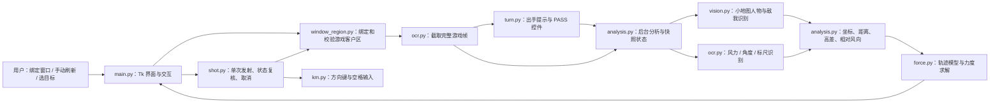

# DDT Sharp Shooter 业务架构与计算原理

本文按当前代码说明业务流程。项目面向 Windows 中具有独立 Flash 游戏子窗口的 36 大厅布局；默认模式负责识别和给出建议力度，只有用户选中目标并点击“发射”，或确认 `ss` 指定力度弹框，才会调用发射控制。

## 1. 业务架构总览



| 模块 | 主要职责 |
| --- | --- |
| `main.py` | 界面、快捷键、窗口绑定入口、展示结果、发射请求和发射前状态检查 |
| `window_region.py` | 找到 Flash 子窗口、计算实际客户区、跟随移动缩放、核验窗口与键盘焦点 |
| `turn.py` | 从截图检测本方回合提示和 `PASS` 控件，抑制同一提示的重复触发 |
| `analysis.py` | 截图裁切、组合识别结果、多目标换算、后台计算与缓存策略 |
| `vision.py` | 在小地图识别人物圆点、本人蓝圈、队友和敌人 |
| `ocr.py` | 风力数字、风向、角度数字、小地图十单位标尺识别 |
| `force.py` | 用拟合轨迹模型求飞行时间和力度 |
| `shot.py`、`km.py` | 管理单次发射、窗口焦点、左右换向、空格蓄力和取消 |

默认链路是“显式绑定窗口 → 取得完整游戏截图 → 检测本方回合或手动刷新 → 识别人物、参数和标尺 → 对每个非本人目标求力度 → 展示 → 用户选择并发射”。后台分析只产出结果，不发送发射按键。`ss` 可在两种模式下输入指定力度；“原有发射模式”另有键盘输入和鼠标标记链路。

## 2. 游戏窗口如何识别与跟随

1. 启动时只恢复侧栏等界面偏好，清除上次的游戏区域和窗口绑定。本次必须拖动顶部“拖动绑定”到游戏画面松开，或把鼠标放在游戏内按 `r`。
2. 在落点使用 Win32 `WindowFromPoint` 找到命中的窗口，用 `GetAncestor(..., GA_ROOT)` 找大厅根窗口，再枚举根窗口及其子窗口。候选控件的类名必须是 `MacromediaFlashPlayerActiveX`，且其客户区包含落点；候选必须恰好一个。
3. 通过 `GetClientRect`、`ClientToScreen` 得到 Flash 控件的**屏幕坐标客户区** `(x, y, width, height)`。要求宽至少 300、高至少 180、宽高比与 `5/3` 的差不超过 `0.06`，且完整位于大厅客户区内。这样截取的是游戏内容，不包括大厅标题、工具栏和下方力度表。
4. 绑定保存大厅和 Flash 控件各自的 `hwnd`、进程 ID、窗口类名。每次截图前重新读取并核验二者，直接使用 Flash 当前客户区，所以移动或缩放大厅后坐标会跟随。控件关闭、重载、最小化、身份改变或画面超出大厅客户区时停止读取并要求重绑。
5. “精细校准”可由用户点击游戏区域左上和右下角。若找到包含该区域的外部窗口，则保存相对大厅客户区的偏移；这条旧式绑定在大厅客户区尺寸变化后需要重新校准。找不到窗口时只保留固定屏幕区域。

截图使用 `pyautogui.screenshot(region=...)`。参考画面宽度是 **1500 像素**，参数裁切框按 `r = 实际游戏宽度 / 1500` 缩放：

```text
实际裁切 x = int(参考 x × r)
实际裁切 y = int(参考 y × r)
实际裁切宽/高 = int(参考宽/高 × r)
```

自动分析从完整游戏帧中裁切：风力 `(709,22,84,54)`、角度 `(43,835,64,36)`、小地图 `(1170,35,330,150)`，坐标均为 1500 宽参考画面内的 `(x,y,w,h)`。裁切超出实际截图时会报区域错误，避免用不完整画面继续计算。原有发射模式的单独截图还会加上窗口的屏幕坐标偏移。

## 3. 何时分析

绑定后后台约每 **0.5 秒**检查一次完整截图。`turn.py` 将参考区域缩放，分别以白色文字掩码匹配“轮到你出手啦”图片、以金色掩码匹配 `PASS` 控件；模板有 `0.9/1.0/1.1` 三档缩放，匹配阈值约为 `0.65`。提示首次出现触发一次分析；短暂消失不会重新触发，持续缺失约 1.5 秒才允许下一次提示触发。

本方回合仍活动时，只轻量读取角度和自己的小地图位置。角度改变，或本人移动达到约 **2 个参考小地图像素**，且连续两次观测稳定，才重新完整识别风力、标尺并求解。活动提示与控件都消失约 1 秒后停止这种检查。`t` 或“计算一次”可手动刷新；同一时刻不堆积分析任务。蓝圈暂时找不到时最多用新截图尝试 5 次，其他参数错误不会盲目重试。

实现位置：[回合识别](../turn.py)、[分析任务](../analysis.py)。

## 4. 风力、角度与标尺如何识别

### 风力

风力图像取自游戏顶部。优先以颜色阈值找红色数字像素，保留高度和面积足够的连通域，把数字掩码交给 `ddddocr`（只允许 `0–9`），并将整数结果除以 10：例如识别到 `25` 表示 `2.5`。若没有可用的红色数字连通域，则走兼容路径：先去除红色干扰，再 OCR，并用轮廓宽度处理部分数字形状造成的整数位或小数位误读。数字结果须为 2 到 3 位，自动分析还要求风力在 `0–99.9` 之间。

风向不是由 OCR 文字给出，而是对风力截图按参考颜色 `(141,141,232)` 二值化，比较左右半幅的掩码均值。左半幅更深时判作**向左**，否则判作**向右**。这是依赖当前游戏风向箭头样式的图像规则；预览截取不完整、被遮挡或客户端样式变化时可能失败。

### 角度

左下角角度截图直接交给限制为数字的 `ddddocr`。结果必须是纯数字且满足 `0 ≤ 角度 ≤ 180`。显示角度 `θ` 在轨迹计算时取仰角 `α = min(θ, 180 − θ)`，因此 `65°` 与镜像方向的 `115°` 使用相同仰角；目标在左还是右，由小地图相对位置单独确定。

### 小地图十单位标尺

`ocr.py` 按参考灰色 `(160,163,169)` 提取小地图中的视野矩形边线。算法找一段合适长度的水平灰线，并要求两端附近有足够长、覆盖率至少约 `70%` 的垂直边，取两条边之间宽度 `P10`。这避免把整张小地图外框误当成标尺。代码将该宽度解释为游戏中的 **10 个距离单位**；`P10 ≤ 0` 时不计算。

实现位置：[参数 OCR 与标尺](../ocr.py)、[画面裁切与参数校验](../analysis.py)。

## 5. 敌我位置与高差如何确定

坐标来自**小地图**，不依赖可滚动的主战斗画面。人物识别先按游戏宽度比把小地图归一化到参考尺寸，再在 HSV 颜色空间用多组色相和中性色掩码寻找圆点，也用平坦颜色核心补充候选。候选经过形态学开运算、连通域尺寸/形状、中心颜色平坦度、圆点与背景颜色差等检查，距离过近的重复候选合并。人物贴近小地图底边、下半圆被裁掉时，使用可见圆弧拟合圆心；证据不足则不猜位置。输出坐标再换回原小地图截图像素。

本人通常由圆点外围的蓝色光圈识别：检查环形区域的蓝色 HSV 像素及各方向覆盖；透明或褪色光圈还会比较 Lab 颜色的蓝黄通道与周边背景。必须恰好识别到一个本人。光圈动画暂时消失时，可在上次蓝圈确认的位置附近寻找唯一圆点，并要求地图背景未明显变化；缓存坐标不跟着邻近圆点推移，丢失超时、背景变化、暂停或重绑会清除。也可在列表“我”列手动指定当前截图中的一个圆点为本人，移动、消失或重叠后须重新指定。

确定本人后，取每个人物圆点主体的 Lab 颜色，与本人颜色计算 `CIEDE2000` 色差 `ΔE`：

| 条件 | 标记 |
| --- | --- |
| 当前本人圆点 | 自己 |
| `ΔE ≤ 12` | 队友 |
| `ΔE ≥ 25` | 敌人 |
| `12 < ΔE < 25` | 身份不确定 |

这些是本帧的颜色分类，不是玩家昵称或固定身份。编号也仅代表当前帧排序。队友与身份不确定的人物仍会显示建议力度，用户可自行选择；程序不会自动挑选敌人发射。

设本人圆心为 `(xs, ys)`，目标圆心为 `(xt, yt)`，`P10` 为上述标尺宽度。小地图屏幕坐标的 `y` 轴向下，因此：

```text
目标方向 = xt < xs ? 左 : 右
水平距离 dx = |xt − xs| / P10 × 10       （非负）
高低差   dy = (ys − yt) / P10 × 10       （目标高于本人为正）
```

水平像素差小于 1 时标为“近乎垂直”，当前多目标流程要求调整位置，不求发射力度。设风力读数为 `w ≥ 0`，风向与目标方向一致则 `w相对 = +w`，相反则 `w相对 = −w`。求解时总把**目标方向**作为正 `x` 方向；这也是左侧目标可与右侧目标共用一套公式的原因。

实现位置：[圆点与敌我识别](../vision.py)、[多目标距离换算](../analysis.py)。

## 6. 力度计算公式

`force.py` 用拟合得到的阻力、风加速度和重力常数构造二维轨迹模型。令力度为 `F`，飞行时间为 `t > 0`，仰角 `α = min(θ, 180−θ) × π/180`，相对风力为 `w相对`；常数为：

```text
k = 1.05235296          阻力系数 DRAG
c = 5.50186622          风加速度系数 WIND_ACCELERATION
g = −163.56591668       竖直加速度 GRAVITY
A(t) = (1 − exp(−k t)) / k
B(t) = (t − A(t)) / k
```

落点与起点的位移为：

```text
x(t) = F cos(α) A(t) + c · w相对 · B(t)
y(t) = F sin(α) A(t) + g · B(t)
```

要求落在目标 `(dx, dy)`。当 `cos(α)` 非零，消去 `F` 得：

```text
B目标 = [dy − dx tan(α)] / [g − c · w相对 · tan(α)]
求 t > 0，使 B(t) = B目标
F = [dx − c · w相对 · B目标] / [cos(α) · A(t)]
```

当 `α = 90°`、水平初速度为零时，水平位移只能由风产生，改用：

```text
B目标 = dx / (c · w相对)
F = [dy − g · B目标] / [sin(α) · A(t)]
```

若 90° 且相对风加速度也为零，则无法确定唯一力度。代码先检查输入、分母和 `B目标` 是否有效，再用 `scipy.optimize.brentq` 解正飞行时间，回代算力度，最后把 `(F,t)` 代回轨迹做残差校验。无正力度解或残差过大时显示原因。

自动分析使用**未截断的解**：`F > 100` 时显示“当前角度力度不足”，不允许按钮发射；只在 `0 < F ≤ 100` 且状态为“可用”时允许选择。原有手动公式接口 `calc_force` 默认把结果截到 100，这与默认分析模式的展示方式不同。上述常数是项目对力度表和简化运动模型的拟合参数，模型没有考虑障碍、武器特效和不同游戏物理环境的偏差。

实现位置：[轨迹与求解器](../force.py)、[目标参数与状态](../analysis.py)。

## 7. 发射如何执行

### 默认分析模式：选中目标行

选中的必须是当前有效结果中唯一的**非本人**目标；其方向须为左或右、状态为“可用”，并且显示的两位小数力度须在 `(0,100]`。分析更新、切换模式或结果变旧时选择失效。点击“发射”后，界面冻结本次力度、方向及计算时的角度/本人位置，交给单任务 `ShotController`。

发射线程先验证绑定仍有效，激活大厅窗口并将键盘焦点交给 Flash 控件，再检查前台窗口和键盘焦点。若需换向，使用 Windows `SendInput` 在同一调用中发送一次左/右方向键的按下与松开。换向前复核当前角度与本人位置；松开后等待约 100 毫秒，再至少间隔 50 毫秒复核两次。本人移动达到 **1 个参考小地图像素**、角度仰角改变或无法可靠识别时，停止本次发射并要求刷新、重选目标。镜像角度如 `65° → 115°` 视为同一仰角。

状态仍有效时，按下空格持续 `蓄力秒数 = 0.04 × 力度 F`，然后松开空格；例如力度 `50` 对应约 `2.00` 秒。计算值按两位小数提交，实际发射受系统调度及游戏计时影响。发射线程一次只接受一个请求，重复点击不排队。`Esc` 可取消；若已在蓄力，松开空格也可能使游戏以当时力度发射。

### 指定力度与原有发射模式

半秒内按两次 `s` 可打开指定力度弹框，输入 `(0,100]` 的数字，用户确认后使用同一个 `ShotController` 聚焦、核验并蓄力，但不代替用户调整方向或角度。原有模式中连续两次 `t` 可进入命令输入；手动输入 `x/y/w/d` 参数或在小地图先标本人、再标目标后按 `t`，走参数识别与 `calc_force`，随后执行旧式 `fire()`：等待约 1.5 秒，再按住空格 `0.04 × F` 秒。旧式 `fire()` 的焦点与状态保护不等同于默认模式的目标行发射，应以实际游戏画面为准。

实现位置：[发射入口及状态校验](../main.py)、[发射控制](../shot.py)、[按键发送](../km.py)、[窗口焦点校验](../window_region.py)。

## 8. 主要边界与排查线索

- 这套自动绑定依赖独立的 `MacromediaFlashPlayerActiveX` 控件和近似 `5:3` 的完整游戏画面；其他登录器可能需要精细校准。
- 风力、角度、小地图必须完整显示且不被辅助窗遮挡。界面中的“风力截取”“角度截取”和小地图预览是实际读入的区域，可先据此检查绑定是否偏移。
- 圆点被遮挡、重叠、颜色过近、蓝圈缺失，或标尺边线不清楚时，自动分析会给出失败或身份不确定状态；不会用失败结果发射。
- 风力、道具或其他人物位置变化本身不会触发本回合的轻量参数检查，需按 `t` 手动刷新。发射前的状态复核主要检查角度和本人位置，不重新求完整风力与目标距离。
- 结果只是依据当前截图和拟合模型计算的建议值；实际命中仍取决于游戏内状态和模型误差。
